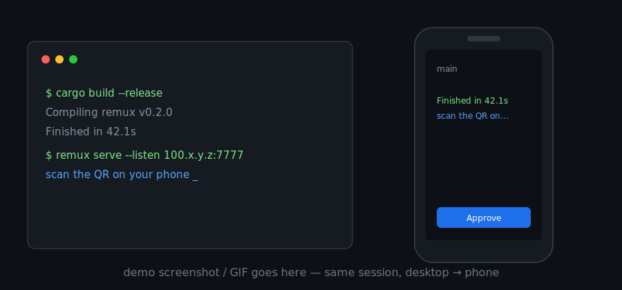

# remux

> Your persistent tmux session, on your phone.

[](https://github.com/jorgeamado/remux/actions/workflows/ci.yml)
[](https://github.com/jorgeamado/remux/releases)
[](LICENSE)


remux is a small self-hosted daemon that exposes your tmux session to your own
devices as a mobile-friendly web terminal (PWA). Start work on your computer
(mosh/ssh → tmux), glance at a running job or Claude Code from your phone, type
a reply, put the phone down, and keep typing at your desk — the session never
restarts, and the terminal resizes to whichever device is active.



<!-- TODO: replace docs/media/demo-placeholder.svg with a real screenshot or a
     short screen recording (GIF/MP4). Good things to capture: the resize
     handoff desktop→phone, the session/window picker, an Approve/Deny card,
     the command feed panel, and a lock-screen notification. -->

See [DESIGN.md](DESIGN.md) for the architecture and design review.

## What you get

- **The same tmux session on every device** — attach from your phone and your
  desktop at once; the terminal resizes to whichever is driving, and locking
  the phone hands the size straight back to the desktop.
- **No history replay** — new connections get an instant full repaint from tmux.
- **Lock-screen notifications** — when a session goes from busy to quiet (a
  build finished, Claude Code is waiting on you), get a Web Push notification
  even with the phone locked. Payload-less: no terminal content ever leaves.
- **Approve agents from your phone** — Claude Code permission prompts can open
  an Approve/Deny card on a trusted device; deny or approve without walking
  back to the keyboard (opt-in, falls back to the on-host prompt).
- **Command feed** — an opt-in shell hook streams each command's start/finish
  (what ran, exit code, duration) to a per-session feed, with failure alerts.
- **Yours only** — binds to your tailnet, runs as your user (never root), never
  logs terminal I/O, and every request is Host/Origin-checked.

## How it works

```
Mac    → mosh → tmux client            ┐
                                       ├─ same tmux session
Phone  → PWA (xterm.js) → remux → tmux client (PTY)
```

- Each browser connection becomes a real tmux client attached to your session.
- New connections get an instant full repaint from tmux (no history replay).
- Observers watch; **Take control** makes the phone drive the terminal size
  (`window-size latest`). Typing on your desktop takes it back automatically.
- Locking the phone or losing signal just detaches that tmux client — your
  desktop immediately gets its dimensions back.
- Tap the session name in the top bar to switch to another tmux session or
  create a new one. The **+** button lists the session's windows (switch with
  a tap) and creates windows, splits, or cycles panes — controller only.

## Install

Requirements on the host: `tmux` ≥ 3.2 (3.3a tested), Linux or macOS.
(Windows: run it inside WSL2 — the daemon needs tmux, which has no native
Windows build.)

**Debian/Ubuntu** — grab the `.deb` from the
[releases page](https://github.com/jorgeamado/remux/releases) (a systemd
user unit ships with it, see below):

```sh
sudo apt install ./remux_*.deb
```

**macOS (Homebrew)**:

```sh
brew tap jorgeamado/remux
brew install remux
```

**Prebuilt tarballs** for Linux (x86_64/arm64) and macOS (arm64/x86_64) are
on the releases page with SHA256SUMS. Every artifact carries sigstore build
provenance — verify what you downloaded was built by this repo's CI:

```sh
gh attestation verify remux-*.tar.gz --repo jorgeamado/remux
```

**From source**:

```sh
(cd web && npm ci && npm run build)   # PWA, embedded into the binary
cargo install --path .
```

## Run

```sh
remux serve --listen <tailscale-ip>:7777
```

On startup remux prints a pairing link and QR code (valid 10 minutes,
reusable within that window). Open it on your phone over your tailnet and
the device pairs and connects.

**iOS, for the full-screen app**: after pairing in Safari, tap Share → Add
to Home Screen, open remux from the Home Screen, and paste the same pairing
link there (the installed app has separate storage — the page offers a
"Copy link" button for exactly this).

When the daemon runs as a service (QR buried in logs), mint a fresh link
any time with:

```sh
remux pair
```

Once you're in, [Using the app](#using-the-app) walks through the UI.

### TLS (recommended, required for PWA install on iOS)

Self-signed certificates do not work with iOS PWAs. Use Tailscale's built-in
certificate support for your machine's MagicDNS name:

```sh
tailscale cert your-host.your-tailnet.ts.net
remux serve \
  --listen <tailscale-ip>:7777 \
  --tls-cert your-host.your-tailnet.ts.net.crt \
  --tls-key  your-host.your-tailnet.ts.net.key \
  --allowed-host your-host.your-tailnet.ts.net \
  --url https://your-host.your-tailnet.ts.net:7777
```

### Options

| Flag | Default | Meaning |
|---|---|---|
| `--listen` | `127.0.0.1:7777` | Bind address. Use your Tailscale IP; never a public one. |
| `--session` | `main` | tmux session to attach clients to (created if missing). |
| `--tls-cert` / `--tls-key` | — | PEM cert/key (see `tailscale cert`). |
| `--allowed-host` | — | Extra hostnames accepted by the Host/Origin guard. |
| `--allowed-client-origin` | — | Exact origin of another machine's remux PWA allowed to use this daemon (see [Multiple machines](#multiple-machines)). |
| `--machine-name` | hostname | Display name shown by multi-machine clients. |
| `--url` | derived | Public URL used in the pairing QR. |
| `--no-pair` | — | Don't print a pairing token at startup. |

To pair another device later, run `remux pair` — it asks the running daemon
for a fresh link over a local admin socket (0600, in the state dir; it never
listens on the network).

### Certificate renewal

`tailscale cert` certificates expire after ~90 days; the daemon warns when
the cert file looks stale. The `.deb` ships a weekly renewal timer:

```sh
systemctl --user enable --now remux-cert-renew.timer   # uses ~/.config/remux/env
```

Elsewhere, re-run `tailscale cert …` and restart the daemon (for the Docker
setup: re-run it on the host, then `docker restart remux-mobile`).

### Run as a service (Linux)

The `.deb` installs a systemd user unit
([packaging/remux.service](packaging/remux.service)); configure it via
`~/.config/remux/env`:

```sh
mkdir -p ~/.config/remux
echo 'REMUX_ARGS=--listen 100.x.y.z:7777 --no-pair' > ~/.config/remux/env
systemctl --user enable --now remux
loginctl enable-linger $USER   # keep it running while logged out
```

Installed another way? Copy the unit to `~/.config/systemd/user/` first.

### Multiple machines

Run a daemon on every machine; the app installed from one of them (your
"home" machine) can attach to all of them. Daemons stay fully independent —
there is no hub, no relay: if a machine is up, you can reach it, regardless
of the others.

On each *other* machine, allow the home machine's PWA origin:

```sh
remux serve ... --machine-name laptop \
  --allowed-client-origin https://home-mac.your-tailnet.ts.net:7777
```

Then in the app: session name → **Add machine…** → paste the pairing link
printed by `remux pair` on that machine (one paste pairs — the link carries
both the address and the token; a bare URL works too, the token is asked for
next). Or **Scan QR to add…** to point the camera at the pairing QR from
inside the app — scanning it with the OS camera would instead open that
machine's own PWA in the browser. The switcher (same menu) moves
between machines; exactly one machine is connected at a time — switching
closes the previous connection on purpose, so backgrounded machines can
still reach your lock screen via push and never linger as phantom tmux
clients.

Notes:
- Machine URLs must be `https://` (localhost is exempt, for development).
- Web Push (lock-screen delivery) comes from the home machine only for now —
  other machines' events show in-app while you're attached, and the
  notification tap re-checks every machine. A cross-machine push
  coordinator is on the roadmap.
- Simplest alternative: install each machine's own PWA and rename the icons
  ("remux laptop", "remux server") — no flags needed, at the cost of one
  icon per machine.

## Using the app

A quick tour of the phone UI, top to bottom.

**The screen.** The top bar shows the session name on the left (tap it — that's
the main menu) and the connection state on the right. Below it: the control row
(your role and the **Take control** button), the window/pane tabs, the terminal,
and the composer with its key rows.

**Observer vs. controller.** Every open connection is a real tmux client, but
only one drives the terminal size. You connect as an *observer*: you see
everything live but the grid stays sized for whoever is typing. **Take
control** resizes the session to your phone; **Release** (or simply typing on
your desktop) hands it back. Locking the phone or losing signal releases
automatically — your desktop gets its dimensions back immediately.

**Press — tap without taking over.** As an observer, the **Press** button arms
tap-to-press: tap a text-UI element on screen (a Claude Code *Allow* button, a
menu entry, a fuzzy-finder row) and remux presses it on the host — no take-over,
no resize, nobody's layout disturbed.

**Typing.** On touch devices the composer is the input line: type a command,
**➤** sends it (with Enter). **▴** recalls previously typed commands — history
lives in memory only, per machine and session, and never touches disk. **⌄**
toggles the key row: `esc` `ctrl` (arms the next key) `tab` arrows `enter`, and
**…** for more. When an agent is running you also get dedicated keys: interrupt
(`ctrl+c`), cycle agent mode (`shift+tab`), and rewind (`esc esc`). *Extra
keys* in the aA menu picks the deck style (auto / expanded / compact); *Direct
typing* makes taps on the terminal type straight into it — the default on
desktop, off on phones so tapping the screen doesn't summon the keyboard.

**Sessions and machines.** Tap the session name to switch between tmux
sessions, create one (**New session…**), jump between paired machines, or add a
machine (**Add machine…** / **Scan QR to add…** — see
[Multiple machines](#multiple-machines)).

**Windows and panes.** The tabs under the control row are the session's tmux
windows — tap to switch (controller only). A split window shows a pane row
beneath. **+** creates: new window, side-by-side or stacked split, next pane.
Tabs carry agent status badges: purple = an approval is waiting, amber = the
agent is waiting for your reply.

**Dashboard.** The **Dashboard** button swaps the terminal for an at-a-glance
view — session/window tree, agent workers, a system snapshot. Tap **Terminal**
to go back.

**The aA menu.** Font size (**A−/A+** — effectively the terminal resolution:
smaller font, more columns), **Paste**, **Notifications**
(see [Notifications](#notifications)), *Direct typing*, *Extra keys*,
**Command feed** (see [Agent approvals & the command feed](#agent-approvals--the-command-feed)),
**Devices** (your paired devices), and a **Debug** overlay.

## Security model

- Binds to your tailnet/localhost only; Tailscale (WireGuard) is the network
  boundary.
- Application auth on top: QR pairing → per-device revocable token
  (stored hashed in `~/.local/share/remux/devices.json`); nothing happens on a
  connection before authentication.
- Host/Origin allowlist on every request blocks DNS rebinding and cross-site
  WebSocket hijacking from malicious websites.
- The daemon runs as your user, never root, and never logs terminal I/O.

## Development

Everything runs in the devcontainer (`.devcontainer/`):

```sh
devcontainer up --workspace-folder .
devcontainer exec --workspace-folder . bash

# daemon + tests
cargo test                       # unit + integration (isolated tmux socket)

# web client
cd web && npm install && npm run build    # outputs web/dist, embedded by cargo

# browser e2e (spawns the real daemon)
cd web && npx playwright install chromium && npm run e2e
```

The web client dev loop: `cd web && npm run dev` proxies `/api` and `/ws` to a
locally running daemon on `127.0.0.1:7777`.

## Notifications

Toggle **Notifications** in the aA menu (asks for browser permission). When a
session has been busy and then goes quiet — a build finished, Claude Code is
waiting for your answer — remux notifies you.

- In-app: an alert while the page is open but not visible; you're only
  notified for the session you're attached to.
- **Lock screen (Web Push)**: enabling the toggle inside the *installed* PWA
  also subscribes the device with the OS push service, so a locked phone
  gets notified even though its socket is dead. The push carries no terminal
  content or session names — on open, the app asks the daemon which session
  wants attention and offers to jump there. No pushes are sent while someone
  is actively typing at any attached client, and delivery is throttled.

## Agent approvals & the command feed

- **Approve from your phone**: `remux emit permission` is a *blocking*
  PermissionRequest hook helper — when Claude Code asks to run a tool, it opens
  a card on your paired, approve-capable device (grant it with `remux devices
  grant-approve <id>`). Approve/Deny remotely; if the command is too long to
  show in full, remote Approve is disabled and you decide on the host, which
  sees the whole command. Safe by construction: if the daemon is down, no
  device can approve, or the card expires, the helper exits non-zero and Claude
  Code simply falls back to its normal on-host prompt — it never auto-approves.
  This is remote *authorization by a second human*, not a security boundary
  (a same-user process can bypass it), and it is bypassed by
  `--dangerously-skip-permissions`. The daemon/CLI + phone path is done and
  drivable today with `remux test-permission`. Wiring a real Claude Code to it
  is packaged as a small **Claude Code plugin** (a `PermissionRequest` command
  hook that calls `remux emit permission`); see `docs/STATUS.md` for status.
  If you have a Claude subscription, Anthropic's own **Remote Control** covers
  the same need natively; remux's path is for self-hosted / API-key / non-
  subscription setups that Remote Control doesn't reach.
- **Command feed**: `remux setup shell` installs an opt-in hook (bash or zsh,
  auto-detected; it explains itself and asks first) that streams each command's
  start/finish — what ran, exit code, duration — to a per-session feed on your
  phone, plus precise failure notifications ("a command failed (101) in main").
  Metadata only: command lines travel over the authenticated connection and
  stay in daemon memory — never the lock screen, never disk. Remove with `remux
  setup shell --uninstall`.

## Roadmap

V1.x: device management UI, launchd/systemd unit files.
V2: tmux control-mode metadata (panes as tabs/cards), snapshot/delta sync with
a custom renderer, server-paged scrollback.
V3 (shipped): hook-based shell command feed, Web Push notifications, and the
approval-card path (daemon + phone UI). Wiring a real Claude Code to the
approval cards ships as a small Claude Code plugin (a `PermissionRequest`
command hook) — see `docs/STATUS.md`. Still exploratory: OSC 133 shell
integration and streamed command *output* (built only if command metadata
proves insufficient).

## FAQ

**Is this exposed to the internet?** No. remux binds to your Tailscale IP or
localhost; WireGuard is the network boundary. Never bind it to a public address.

**Does it store my terminal output?** No. The daemon never logs terminal I/O,
and nothing is persisted except your hashed device tokens and push keys.

**Do I need Tailscale?** It's the zero-config path (private network + one-command
TLS certs). Any VPN or reverse proxy that gives you a private hostname works;
Tailscale is just what the docs assume.

**Windows?** Run it inside WSL2 — the daemon needs `tmux`, which has no native
Windows build.

## Contributing

Issues and PRs welcome. The whole project builds and tests in the devcontainer
(see [Development](#development)); please run `cargo test`, `cargo clippy`,
`cargo fmt --check`, and the web build before opening a PR — CI enforces all of
them. Security reports: see [SECURITY.md](SECURITY.md).

## License

[MIT](LICENSE) © George Lemeshko.
